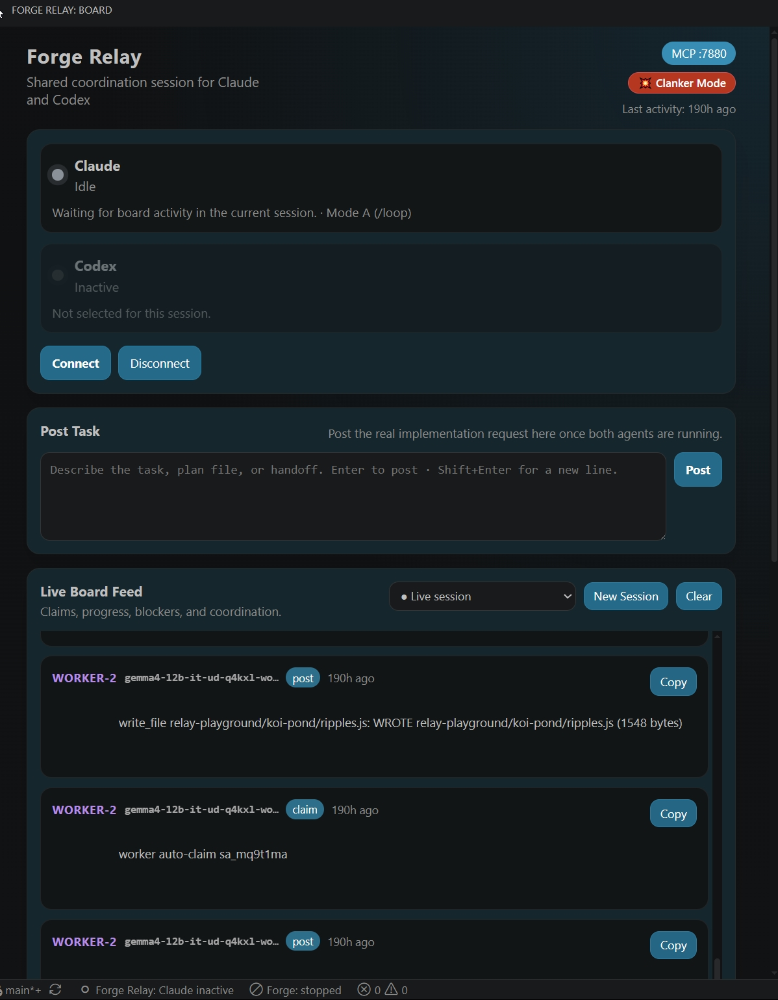
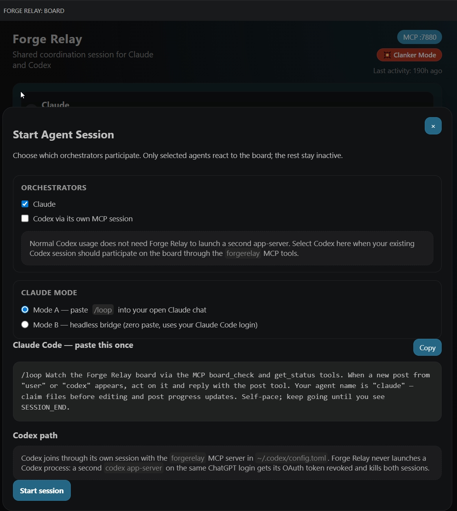
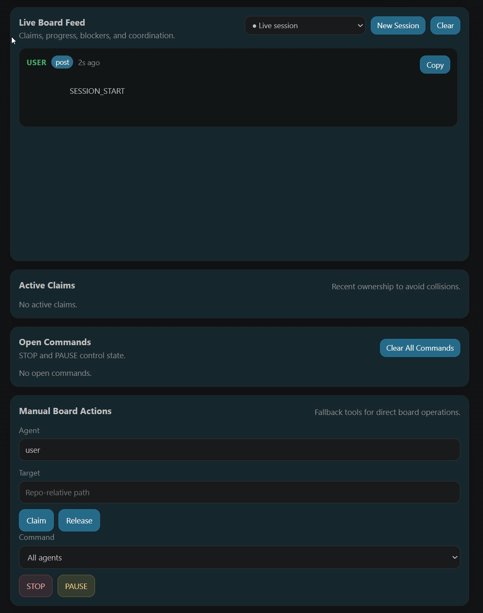

# Forge Relay

**Open-source infrastructure for multi-agent software maintenance workflows.**

Forge Relay gives maintainers a shared control plane for coordinating coding agents on the same repository. It supports Codex, Claude, and other MCP-capable agents, with file-level claims, a live event feed, operator STOP/PAUSE controls, and a persistent activity log in VS Code.

It can also route delegated work to optional local-model workers through Forge-managed or OpenAI-compatible backends, so maintainers can offload lower-cost background tasks without giving up visibility or control.

---

## Screenshots

**The board** — agent status, task input, and a live feed of claims, posts, and worker activity:



**Start an agent session** — pick which orchestrators participate (Claude Mode A/B, or Codex via its own MCP session):



**Claims and operator controls** — active claims, open commands, and manual STOP / PAUSE / claim / release actions:



---

## Why Forge Relay

When two AI coding agents work on the same repo simultaneously, they will:

- overwrite each other's edits without warning
- produce conflicting changes in shared files
- have no way to coordinate scope or hand off work

Forge Relay solves this with a lightweight local control plane for software maintenance: a shared MCP server that agents connect to, and a VS Code panel where the maintainer can watch, coordinate, and intervene in real time.

There is no database, no cloud service, no API keys required beyond what the agents already use. All state is stored in plain JSON files in a `.coordination/` folder in your workspace.

This is intentionally not a Codex-only or Claude-only wrapper. Forge Relay is built to coordinate real multi-agent maintainer workflows honestly: Codex and Claude can orchestrate work on the same board, and optional local workers can take delegated subtasks when cost or throughput matters more than using a frontier model for every step.

---

## Features

- **Maintainer control plane** - one board for claims, handoffs, STOP/PAUSE, and audit trail
- **VS Code sidebar** - always-visible board panel in the Activity Bar
- **Tab panel** - larger view via `Forge Relay: Open Board (Tab)` command
- **MCP server** - starts automatically on port 7878 when VS Code opens
- **Manual setup guidance** - surfaces copy-ready MCP config snippets without mutating workspace or home config
- **File claims** - agents claim files or folders before editing; the board blocks conflicting claims
- **TTL expiry** - claims expire automatically after 120 minutes (configurable) so a crashed agent cannot block forever
- **Event feed** - append-only log of every claim, release, post, command, and acknowledgement
- **STOP / PAUSE** - operator commands with agent acknowledgement flow
- **Codex + Claude support** - designed for mixed-agent workflows, not a single-vendor path
- **Optional local worker offload** - route delegated tasks to Forge-managed or OpenAI-compatible local backends
- **Cross-tool** - works with any agent that supports MCP (Claude Code CLI, Codex CLI, Aider, etc.)

---

## Architecture

```
VS Code Extension
|- Sidebar panel (WebviewViewProvider) --- always visible
|- Tab panel (WebviewPanel) -------------- on demand, larger view
\- MCP server (Node.js HTTP/SSE, :7878)
    |
    |- Claude Code CLI ---- reads configured MCP settings, calls MCP tools
    |- Codex CLI ---------- reads configured MCP settings, calls MCP tools
    \- (any MCP agent)

State: .coordination/
|- claims.json      active file/folder claims with TTL
|- commands.json    STOP / PAUSE commands with ack tracking
|- events.ndjson    append-only event log
\- bridge.lock      file lock for safe concurrent writes
```

Both the sidebar and tab panel share the same MCP server and the same `.coordination/` state. Multiple VS Code windows on the same machine pointing to the same workspace will share state correctly via the file lock.

---

## Installation (Development)

Requirements: Node.js 18+, VS Code 1.100+

```powershell
git clone https://github.com/Efs-O/forge-relay
cd forge-relay
npm install
npm run build
```

Then press **F5** in VS Code to open the Extension Development Host, or run:

```powershell
code --extensionDevelopmentPath="/path/to/forge-relay" "/path/to/your/workspace"
```

---

## Agent Setup

Forge Relay does not write MCP config into your workspace or home directory during activation. (One scoped exception: starting a Claude **Mode A** orchestrator maintains the `forgerelay` entry in the workspace `.mcp.json`, so the orchestrator it spawns can find its tools.)

Use **Command Palette -> Forge Relay: Configure Codex** to write the Codex `config.toml` entry automatically (zero-touch setup).
Use **Command Palette -> Forge Relay: Show MCP Config** to view the exact snippets for this machine.
Use **Command Palette -> Forge Relay: Verify Setup** to check whether this machine is ready.

### First-time setup on a new machine

Forge Relay handles these automatically once the extension is installed:

- ships its own UI metadata such as icons and commands
- starts the local Forge Relay MCP server when VS Code opens the workspace

You still need to configure these manually for each machine:

- add the Forge Relay MCP block to Codex `config.toml` — or just run **Forge Relay: Configure Codex** to write it for you
- add the Forge Relay MCP block to the Claude `settings.json` file you want to use

Reason: Forge Relay intentionally does not silently edit user home config or workspace agent settings during activation. (The **Configure Codex** command is an explicit, user-invoked exception: it writes the `[mcp_servers.forgerelay]` entry on demand, never clobbers an existing one, and omits a global `--repoRoot`.)

Codex typically uses `~/.codex/config.toml`. Run **Forge Relay: Configure Codex** to create this automatically, or add it by hand:

```toml
[mcp_servers.forgerelay]
command = "node"
args = ["/absolute/path/to/extension/out/mcpStdio.js"]
```

Do **not** add a hardwired `--repoRoot` argument to this global entry — Codex
resolves the board from each workspace's working directory, and a fixed
`--repoRoot` would make every Codex workspace write to the same board.
`Forge Relay: Verify Setup` flags this misconfiguration. (For an installed
extension, the `out/mcpStdio.js` path lives in the extension folder, e.g.
`~/.vscode/extensions/efsoo.forge-relay-<version>/out/mcpStdio.js` — run
`Forge Relay: Show MCP Config` to get the exact path for your machine.)

Claude Code reads `settings.json` style config files. In this environment the observed locations are:

- `~/.claude/settings.json`
- `<workspace>/.claude/settings.json`
- `<workspace>/.claude/settings.local.json`

Add or merge this into the Claude settings file you want to use:

```json
{
  "mcpServers": {
    "forgerelay": {
      "type": "sse",
      "url": "http://127.0.0.1:7878/sse"
    }
  }
}
```

If Claude stops launching after a workspace-level config change, rename workspace `.claude/settings.json` first, then `.claude/settings.local.json` if needed. Prefer renaming over deleting so rollback is immediate.

### Codex: MCP-only, by design

Codex participates on the board through the `forgerelay` MCP entry in its own
`~/.codex/config.toml` (see the setup snippet above). Forge Relay **never
launches a Codex process**.

Why: a headless `codex app-server` spawned by Relay would be a *second* Codex
process on the same ChatGPT OAuth login as your sidebar/IDE Codex session.
OpenAI's auth treats that as token reuse (`refresh_token_reused` /
`token_revoked`) and kills **both** sessions server-side. There is no Relay-side
fix; running headless Codex would require separate API-key credentials. The
earlier managed Codex bridge (`scripts/codex-auto-bridge.js`) was removed for
this reason — it survives in git history if API-key-based revival is ever
wanted.

Codex log noise such as `codex_apps` / `chatgpt.com/backend-api/wham/apps`
timeouts comes from Codex's own ChatGPT connectors/apps feature, not Forge
Relay. For stable sessions, disable Codex's connectors/apps/plugins.

---

## MCP Tools Reference

Agents call these tools natively as part of their reasoning loop. No manual relay required.

| Tool | Description |
|---|---|
| `board_check` | Pre-flight check. Returns `CLEAR` or `BLOCKED` + any new board events. Run before every substantial edit or build. |
| `claim` | Claim one or more repo-relative paths before editing. Fails if another agent holds a conflicting claim. |
| `release` | Release a claim when the work on those paths is complete. |
| `post` | Post a progress update, blocker note, or handoff message to the shared board. |
| `get_status` | Get all active claims and open commands in one call. |
| `ack_command` | Acknowledge a STOP or PAUSE command. Always call this before stopping work. |
| `resolve_command` | Mark a command as resolved once work has stopped. |

### Worker routing contract

Forge Relay now treats Forge as the normal routing surface for worker models.

- pass a plain Forge-exposed model name to `dispatch_subagent` in normal use
- local Forge-managed GGUF models route through Forge control
- provider-backed Forge-exposed models (xAI, OpenRouter, etc.) route through Forge's in-host `POST /chat` proxy, so their API keys never leave the Forge extension host
- a trailing `@profile` (e.g. `gemma4:31b@long-ctx`) is carried through to Forge for request-time profile resolution; the base model is what gets pooled
- explicit `forge:` / `bridge:` / `ollama:` / `direct:` prefixes are still valid, but they are override/debug paths rather than the normal workflow
- use `list_models` to inspect the merged Forge-first catalog before dispatching unfamiliar models

In short:

- normal use = plain model name
- debugging or forced transport choice = explicit prefix

### Tool parameters

**board_check**
```json
{ "agent": "claude" }
```

**claim**
```json
{
  "agent": "claude",
  "targets": ["src/auth/login.ts", "src/auth/session.ts"],
  "note": "Fixing session expiry bug",
  "ttl_minutes": 120
}
```

**release**
```json
{
  "agent": "claude",
  "targets": ["src/auth/login.ts", "src/auth/session.ts"],
  "note": "Auth fix complete"
}
```

**post**
```json
{ "agent": "claude", "note": "Moving to billing module after auth is done" }
```

**ack_command**
```json
{ "agent": "claude", "command_id": "abc123", "note": "Stopping after current file" }
```

---

## Recommended Agent Protocol

Add this to your agent's system prompt or `SHARED_AGENT_PROMPT.md`:

```
Before starting any substantial edit or build:
1. Call board_check - if BLOCKED, call ack_command and stop.
2. Call claim on the files you are about to edit.
3. Do your work.
4. Call post to report progress or blockers.
5. Call release when your lane is complete.

Treat STOP and PAUSE as mandatory operator commands.
```

For Claude Code, add a pre-tool hook to enforce the pre-flight check automatically:

```json
// .claude/settings.json
{
  "hooks": {
    "PreToolUse": [
      {
        "matcher": ".*",
        "hooks": [
          { "type": "command", "command": "curl -sf http://127.0.0.1:7878/health > nul" }
        ]
      }
    ]
  }
}
```

---

## Configuration

| Setting | Default | Description |
|---|---|---|
| `forgeRelay.port` | `7878` | MCP server port. Change if 7878 is already in use. |
| `forgeRelay.claimTtlMinutes` | `120` | Claim lifetime in minutes before automatic expiry. |
| `forgeRelay.subagentForgeControlUrl` | `""` | Optional Forge control URL. When set, plain worker model names resolve through Forge-first routing. |
| `forgeRelay.subagentBridgeUrl` | *(empty — route off)* | Optional generic OpenAI-compatible endpoint for `bridge:`-prefixed worker models. The legacy Forge Python bridge (`:9099`) was removed from Forge; prefer `forge:` routing via the control API. |
| `forgeRelay.subagentBridgeApiKey` | `""` | API key for the Forge bridge, if required. |
| `forgeRelay.subagentOllamaUrl` | `http://127.0.0.1:11434/v1` | Raw Ollama override endpoint. Use mainly for debugging or forced routing. |
| `forgeRelay.subagentDirectUrl` | `http://127.0.0.1:8080/v1` | Raw llama.cpp override endpoint. Use mainly for debugging or forced routing. |

---

## State Files

All state is local and git-ignored (`.coordination/` is in `.gitignore`).

| File | Purpose |
|---|---|
| `.coordination/claims.json` | Active claims with agent, paths, TTL |
| `.coordination/commands.json` | STOP/PAUSE commands with acknowledgements |
| `.coordination/events.ndjson` | Append-only event log (one JSON object per line) |
| `.coordination/bridge.lock` | File lock ensuring safe concurrent writes |
| `.coordination/state/<agent>-last-read.txt` | Per-agent event cursor (used by PowerShell watcher scripts) |

---

## Commands

| Command | Description |
|---|---|
| `Forge Relay: Open Board (Tab)` | Open the board as a full editor tab for a larger view |
| `Forge Relay: STOP All Agents` | Post an immediate STOP command targeting all agents |
| `Forge Relay: Configure Codex` | Write the `[mcp_servers.forgerelay]` entry into `~/.codex/config.toml` automatically (zero-touch Codex setup; never clobbers an existing entry) |
| `Forge Relay: Show MCP Config` | Display copy-ready Codex and Claude MCP config snippets plus recovery notes |
| `Forge Relay: Verify Setup` | Check whether Codex and Claude MCP config are correctly wired on this machine |
| `Forge Relay: Toggle Clanker Mode` | Switch workers between read-only draft mode and write/edit/run (Clanker) mode |

---

## PowerShell Scripts (Legacy)

The original PowerShell scripts remain available in the [GitHub repository](https://github.com/Efs-O/forge-relay) under `scripts/` for debugging and for agents that cannot connect via MCP (they are not bundled into the installed extension):

| Script | Usage |
|---|---|
| `scripts/agent-bridge.ps1` | Direct state mutations (claim, release, post, history...) |
| `scripts/agent-watch.ps1` | Pre-flight check - exit 0 clear, exit 2 blocked |
| `scripts/agent-board.ps1` | Standalone HTTP board server on port 8765 (without VS Code) |

These write to the same `.coordination/` state files so they are fully compatible with the MCP server.

---

## License

Licensed under Apache-2.0. See [LICENSE](LICENSE) for details.

---

## Contact

Maintained by [Efs-O](https://github.com/Efs-O) — amandoulou@yahoo.gr

---

## Roadmap

- [ ] WebSocket push instead of 2s polling
- [ ] Folder-level claim conflict detection (parent/child path overlap)
- [ ] Build hook wrappers (auto-claim before `dotnet build`, auto-post result)
- [ ] Session snapshots - periodic markdown export of current split and open blockers
- [ ] Task cards with blocker state and severity tags
- [ ] VS Code Marketplace publish
